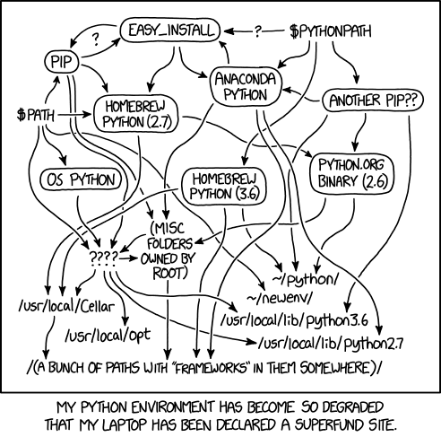

# queues

## typing

Remember first to install mypy
https://plugins.jetbrains.com/plugin/11086-mypy

## poetry


From xkcd.com

poetry add $( cat req.txt )

https://blog.jayway.com/2019/12/28/pyenv-poetry-saviours-in-the-python-chaos/
https://www.jetbrains.com/help/pycharm/poetry.html

https://rgoswami.me/posts/poetry-direnv/
https://python-poetry.org/docs

https://intellij-support.jetbrains.com/hc/en-us/community/posts/115000373944-Why-PyCharm-can-t-resolve-reference-for-a-remote-Docker-interpreter-

## queues

when use docker with pycharm remember to config python interpreter -> Docker Compose -> Choose web service

PROJECT CORE FROM: https://testdriven.io/blog/fastapi-and-celery/

# Asynchronous Tasks with FastAPI and Celery

Example of how to handle background processes with FastAPI, Celery, and Docker.

## Want to learn how to build this?

Check out the [post](https://testdriven.io/blog/fastapi-and-celery/).

## Want to use this project?

Spin up the containers:

```sh
$ docker-compose up -d --build
```

Open your browser to [http://localhost:8004](http://localhost:8004) to view the app or to [http://localhost:5556](http://localhost:5556) to view the Flower dashboard.

Trigger a new task:

```sh
$ curl http://localhost:8004/tasks -H "Content-Type: application/json" --data '{"type": 0}'
```

Check the status:

```sh
$ curl http://localhost:8004/tasks/<TASK_ID>
```

To run all tests:

    docker compose up -d --build 

    docker-compose exec web python -m pytest